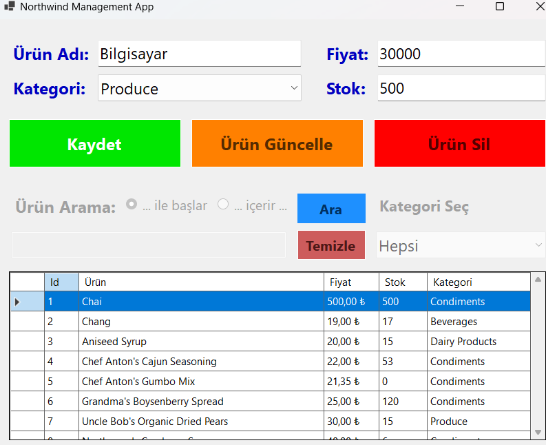
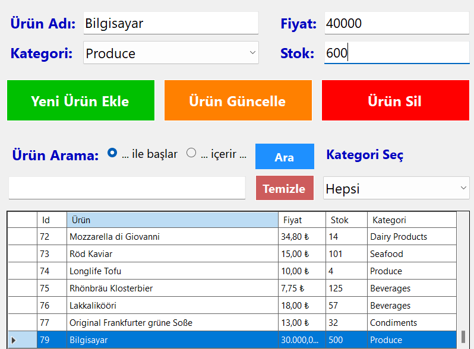
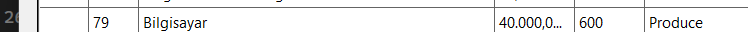
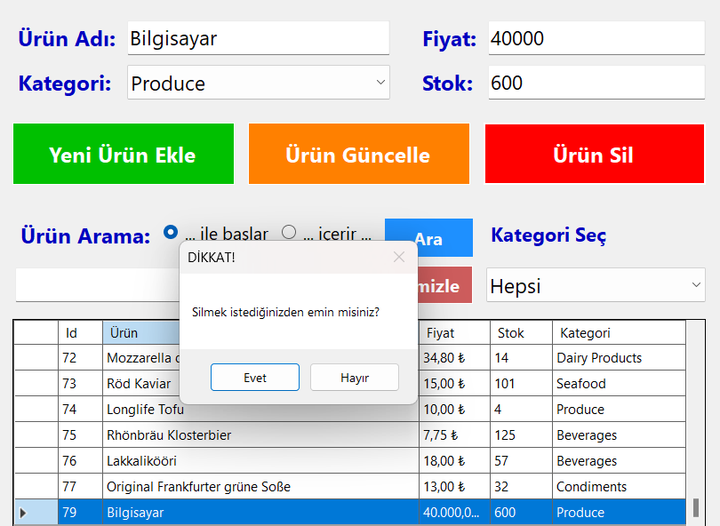
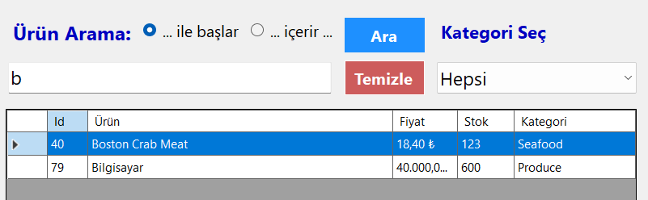
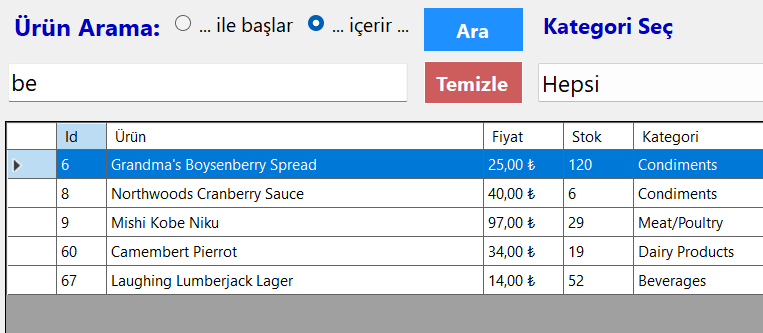
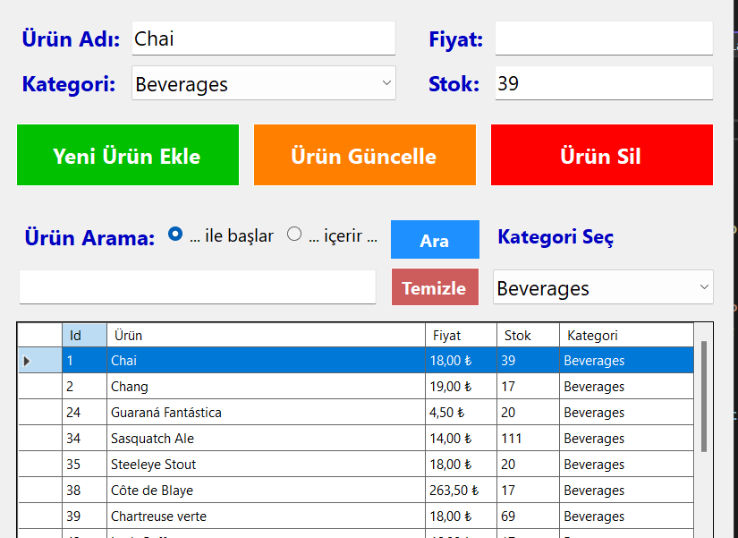

# NorthwindManagement
 Hazır Northwind SQL veritabanını kullanarak hazırladığım windows form uygulmasının  detaylarını görselleriyle birlikte aşağıda inceleyebilirsiniz;

# Ana Menü Ekranı

# Ürün ekleme

# Ürün Güncelle

# Ürün Sil

# Ürün Arama İle başlar

# Ürün Arama İçerir

# Kategoriye göre listeleme

